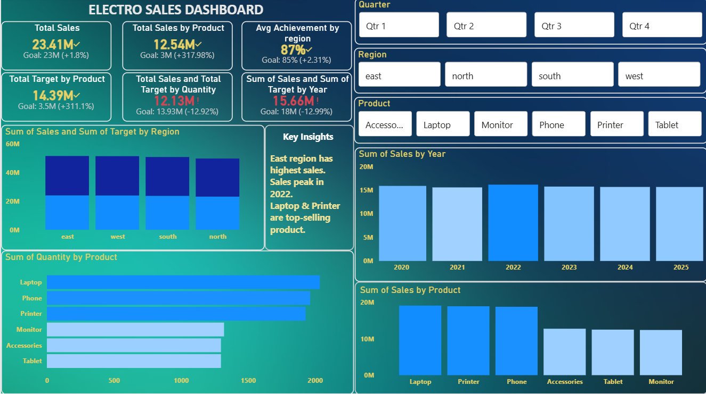

# Sales-Data-Analysis

# Project Title:
Sales Data Analysis using(Pandas and Matplotlib)

# Overview:
- Analyzed sales dataset using Pandas to identify trends and performance metrics 
- Created Visualization(bar,pie and line charts) using Matplotlib
- Compared actual sales with targets to evalute performance
- Generated actionable business insights from data

# Technologies Used:
- Python
- Jupyter Notebook
- Pandas
- Matplotlib

# Project Structure: 
- Data 
       - Sales Dashboard.xlsx
- Analysis
       - Sales project.ipynb

# Code and Visualization:

df = pd.read_excel("Sales Dashboard.xlsx")
df.columns =df.columns.str.strip()

- This shows yearly sales trend
- 
yearly_sales = df.groupby("Year")["Sales"].sum()
print(yearly_sales)
yearly_sales.plot(kind="pie",autopct="%1.1f%%")
plt.title("Sum Of Sales By Yearly")
plt.xlabel("Years")
plt.show()
- code result(yearly_sales)

Year
2020    15889600
2021    15571200
2022    16156800
2023    15746500
2024    15667900
2025    15662100
Name: Sales, dtype: int64

- visualization 

- This show monthly sales trend 

df["Order Date"] = pd.to_datetime(df["Order Date"], dayfirst=True)
month = df["Order Date"].dt.month
monthly_sales= df.groupby(month)["Sales"].sum().sort_index()
print(monthly_sales)
monthly_sales.plot(kind="line")
plt.title("Monthly Sales Trend")
plt.ticklabel_format(style="plain",axis="y")
plt.show()

- code result(monthly_sales)

Order Date
1     7974100
2     7555900
3     7899100
4     7924200
5     8175100
6     7761100
7     7796900
8     8031600
9     8163100
10    7579500
11    7918600
12    7914900
Name: Sales, dtype: int64

- visualization 

- This shows actual dataframe of sales vs target

trending = df.groupby("Region")[["Sales","Target"]].sum()
print(trending)
trending.plot(kind="bar")
plt.title("Sales vs Target by Region")
plt.xlabel("Region")
plt.ticklabel_format(style="plain",axis="y")
plt.ylabel("Sales vs Target")
plt.show()

- code result(sales vs target)

           Sales    Target
Region                    
east    23982900  27548800
north   23137700  26619200
south   23655000  27170100
west    23918500  27495500

- visualization 

- This show Sum of sales based on product 

sum = df.groupby("Product")["Sales"].sum()
print(sum)
sum.plot(kind="pie",autopct=lambda x: int(x * sum.sum() / 100))
plt.title("Sum of Sales based on Product")
plt.xlabel("Product")
plt.show()

- code result(Sum of Sales based on product)

Product
Accessories    12783000
Laptop         19144800
Monitor        12440600
Phone          18823900
Printer        18962400
Tablet         12539400
Name: Sales, dtype: int64

- visualization 

- This show sum of quantity based on product

sum_quantity = df.groupby("Product")[["Quantity"]].sum()
print(sum_quantity)
sum_quantity.plot(kind="bar")
plt.title("Sum of Quantity based on Product")
plt.xlabel("Product")
plt.ticklabel_format(style="plain",axis="y")
plt.ylabel("Sum of Quantity")
plt.show()

- code result(which product sales most)

            Quantity
Product              
Accessories      1298
Laptop           2035
Monitor          1321
Phone            1963
Printer          1929
Tablet           1298

- visualization 

# Powerbi_Visualization

- Displays sales performance across regions and products  
- Includes KPI cards for quick insights  
- Interactive filters for Region, Product, and Quarter  
- Helps track sales vs target performance

# Conclusion
- East region generated highest overall sales. 
- Sales peak in 2022, with May contributing the highest monthly revenue.
- Laptop and Printer are top performing  product.
- Average target Achivement across region is ~87%.
- Most regions underperformed against sales target.

# How to run 
- Clone the repository
- Install required libraries
- Open Jupyter Notebook 
- Run 'Sales project.ipynb' 

# Author 
- Prithvi Raj Choubey
